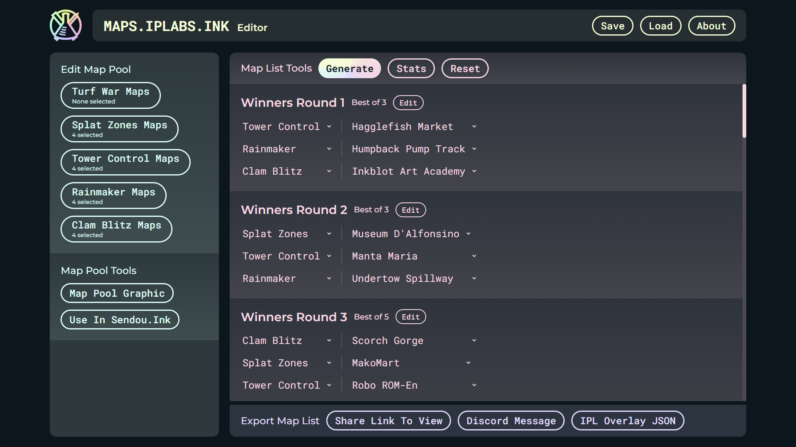

# maps.iplabs.ink

## About
[maps.iplabs.ink](https://maps.iplabs.ink/) is a powerful splatoon tournament map generator. The goal of this app is to help competitive Splatoon community members create quality map lists while making the process easier.

### Features
 - Creation of map pools to denote what maps can appear in each mode.
 - Map lists using rounds that can be named, set to any number of games, and denoted as best of or play all.
 - Algorithmic game generation.
 - Map list stats that show frequency of maps.
 - Local file saving and loading.
 - Easy sharing through links.
 - Map pool image creator.
 - Use map pools created in the app in [sendou.ink](https://sendou.ink/maps).
 - Export map lists to a JSON that can be read by [IPL Overlay Controls](https://github.com/inkfarer/ipl-overlay-controls).
 - Export map lists to a neatly formatted Discord message.
 - Export map lists as a dedicated viewer page that makes it easier to share a map pool and rounds.

**Editor:**

**Viewer:**

**Map List Graphic:**

## Development
This app is made with [Lit](https://lit.dev/), [Typescript](https://www.typescriptlang.org/), and [Vite](https://vitejs.dev/)

Install dependencies: `npm i`

Enter dev mode: `npm run dev`

Build for production: `npm run build`