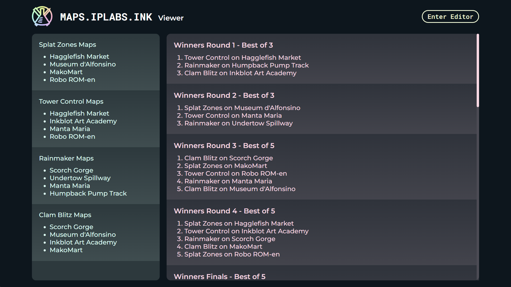

# maps.iplabs.ink

## About
[maps.iplabs.ink](https://maps.iplabs.ink/) is a powerful splatoon tournament map generator. The goal of this app is to help competitive Splatoon community members create quality map lists while making the process easier. Check out the [tutorial](https://github.com/IPLSplatoon/maps.iplabs.ink/wiki/Tutorial) to learn how to use it.

### Features
 - Creation of map pools to denote what maps can appear in each mode.
 - Map lists using rounds that can be named, set to any number of games, and denoted as best of or play all.
 - Algorithmic game generation.
 - Map list stats that show frequency of maps.
 - Local file saving and loading.
 - Easy sharing through links.
 - Map pool image creator.
 - Use map pools created in the app in [sendou.ink](https://sendou.ink/maps).
 - Export map lists to a JSON that can be read by [IPL Overlay Controls](https://github.com/inkfarer/ipl-overlay-controls).
 - Export map lists to a neatly formatted Discord message.
 - Export map lists as a dedicated viewer page that makes it easier to share a map pool and rounds.

**Editor:**

**Viewer:**

**Map Pool Graphic:**

## Development
This app is made with [Node.js](https://nodejs.org/en), [Lit](https://lit.dev/), [Typescript](https://www.typescriptlang.org/), and [Vite](https://vitejs.dev/)

### Installation:

1. Install Node.js; this app was built using v18.13.0.
2. Clone this repo using the following terminal command `git clone https://github.com/IPLSplatoon/maps.iplabs.ink.git`
3. In the same terminal, switch to the project's directory `cd maps.iplabs.ink`
4. Install project dependencies `npm i`

Edit source code in the `src` directory. Code from there can be built into the `dist` directory (created when you build)

Build the app using `npm run build`

Enter dev mode using `npm run dev`
